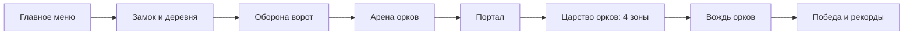
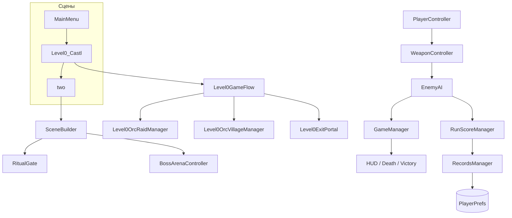

<div align="center">

# ⚔️ ArenaEscape

**Динамичный фэнтезийный FPS о защите человеческого королевства и походе в земли орков.**


</div>

> [!NOTE]
> ArenaEscape находится в активной разработке. Текущая версия содержит полный маршрут от главного меню до финального босса и успешно импортируется и компилируется в Unity `6000.2.13f1`, но ещё требует финальных игровых прогонов, балансировки и звуковой полировки.

## Об игре

Король погиб, деревня разорена, а орки уводят людей в своё логово. Игроку предстоит вооружиться, отбить нападение на замок, пройти через захваченную территорию и портал, а затем штурмовать царство орков и победить их Вождя.

ArenaEscape строится вокруг короткого, насыщенного забега продолжительностью примерно **12–15 минут**. Здесь нет длинной RPG-прокачки и сложных сохранений: один запуск — одна попытка, а главным поводом вернуться становятся лучший счёт, скорость прохождения и серия убийств.



## Ключевые особенности

- **Три стиля боя:** комбо мечом, метательное копьё и скорострельный лук с прицеливанием.
- **Подвижный FPS-контроллер:** спринт, двойной прыжок, боковые уклонения с короткими кадрами неуязвимости и рывок во время атаки.
- **Весомый боевой фидбек:** hit-freeze, stagger, критические удары, hit marker, floating damage, camera shake, slow motion и ragdoll при убийстве.
- **Разные противники:** воины, лучники, берсерки, танки, шаманы, элитные орки и трёхфазный финальный босс.
- **Сюжетный первый уровень:** NPC, кузнец, оборона ворот, союзники, волны врагов, мини-крафт огненных стрел и способность королевского огненного шара.
- **Четыре зоны финального уровня:** холмы, форт, храм и кузня с собором и ареной босса.
- **Система мастерства:** очки за убийства, headshot, крит, дальность, серии и быстрое прохождение.
- **Локальные рекорды:** лучший счёт, время, число убийств, серия, дальность убийства и история пяти лучших забегов.
- **Процедурные системы:** финальный уровень собирается во время запуска, NavMesh запекается runtime-кодом, а основные боевые SFX генерируются через `AudioClip.Create`.

## Что проект демонстрирует как Unity / C# портфолио

ArenaEscape — не только игровой прототип, но и практический проект, на котором реализованы основные задачи Unity-разработчика: управление состоянием игры, gameplay-системы, AI, физика, работа со сценами и runtime-сборка игрового мира.

| Навык | Где применяется в проекте |
|---|---|
| **Unity Core** | `MonoBehaviour`, жизненный цикл `Awake/Start/Update`, `GameObject`, `Transform`, компоненты, сцены и runtime-создание объектов |
| **C# / ООП** | разделение логики по классам и подсистемам, свойства, enum-состояния, инкапсуляция, композиция компонентов и корутины |
| **Gameplay Programming** | FPS-контроллер, спринт, двойной прыжок, dodge, здоровье, оружие, урон, критические попадания, scoring и checkpoints |
| **AI / State Machine** | `EnemyAI` со состояниями `Patrol → Chase → Attack → Dead`, ближний и дальний бой, retreat/flanking-поведение |
| **NavMesh** | `NavMeshAgent`, поиск безопасной позиции через `NavMesh.SamplePosition`, runtime bake навигации и управление преследованием |
| **3D-математика и физика** | `Vector3`, `Quaternion`, направления и дистанции, world/local transforms, `Raycast`, `LayerMask`, Collider/Trigger и физические проверки |
| **Паттерны проектирования** | Singleton-подход в игровых менеджерах, Factory в `L0OrcFactory`, конечный автомат состояний для AI |
| **Runtime Generation** | `SceneBuilder` программно собирает зоны уровня, окружение, противников, материалы, точки маршрута и NavMesh |
| **Game State / Persistence** | управление победой/смертью/паузой, статистикой забега, рекордами и локальными данными через `PlayerPrefs` |
| **UI / Feedback** | HUD, pause/death/victory screens, hit markers, floating damage, camera shake, hit-stop и другие системы игрового фидбека |
| **Assets / Rendering** | URP, материалы, текстуры, Shader Graph/VFX-паки и интеграция сторонних ассетов в игровые сцены |
| **Git-подготовка Unity-проекта** | в репозитории оставлены `Assets`, `Packages`, `ProjectSettings`, исходники и документация; временные Unity-каталоги исключаются через `.gitignore` |

### Ключевые паттерны в коде

- **Singleton** — доступ к центральным игровым системам (`GameManager`, `SceneBuilder`, `PlayerController` и другие менеджеры).
- **Factory** — `L0OrcFactory` создаёт и конфигурирует разные типы противников с общим API.
- **Finite State Machine** — поведение `EnemyAI` разделено на состояния патрулирования, преследования, атаки и смерти.
- **Component-based architecture** — механики разделены между независимыми Unity-компонентами: движение, здоровье, оружие, AI, scoring, feedback и управление игровым циклом.

## Управление

| Действие | Клавиша |
|---|---|
| Движение | `WASD` |
| Камера | Мышь |
| Спринт | `Left Shift` |
| Прыжок / двойной прыжок | `Space` |
| Уклонение влево / вправо | `Q` / `E` |
| Атака / бросок / выстрел | `ЛКМ` |
| Прицел лука | удерживать `ПКМ` |
| Быстро сменить меч и копьё | `ПКМ` с оружием ближнего боя |
| Выбор оружия | `1` / `2` / `3` |
| Следующее оружие | `Tab` |
| Взаимодействие | `F` |
| Огненный шар после разблокировки | `Z` при полном заряде |
| Пауза | `Esc` |

## Как запустить проект

### Требования

- Unity Hub;
- **Unity `6000.2.13f1`**;
- Windows — основная целевая платформа проекта;
- Git LFS рекомендуется, если в репозиторий будут добавляться крупные бинарные ассеты.

### Запуск в редакторе

1. Клонируйте репозиторий:

   ```bash
   git clone https://github.com/Shira-Artem/-ArenaEscape-.git
   ```

2. В Unity Hub нажмите **Add → Add project from disk** и выберите папку проекта.
3. Убедитесь, что выбрана версия Unity `6000.2.13f1`.
4. Дождитесь первого импорта ассетов и компиляции скриптов.
5. Откройте сцену `Assets/MainMenu.unity` и нажмите **Play**.

Если противники на первом уровне не двигаются после чистого импорта, пересоберите NavMesh для `Level0_Castl` через инструменты **AI Navigation**. Финальный уровень создаёт и запекает свою навигацию во время запуска.

### Сборка

Порядок сцен уже задан в Build Settings:

1. `Assets/MainMenu.unity`
2. `Assets/Level0_Castl.unity`
3. `Assets/two.unity`

Сцена `one.unity` является устаревшей и намеренно исключена из сборки.

## Техническая часть

### Стек

| Компонент | Использование |
|---|---|
| Unity 6 / C# | Игровой цикл, боевые и сюжетные системы |
| Universal Render Pipeline | Рендеринг, материалы, Shader Graph и постобработка |
| Unity AI Navigation | NavMesh-навигация и преследование игрока |
| CharacterController | FPS-передвижение, прыжки и уклонения |
| PlayerPrefs | Рекорды и статистика забегов |
| IMGUI / `OnGUI` | HUD, pause, death, victory и records screens |
| Runtime builders | Сборка окружения, врагов и интерактивных зон из кода |

### Архитектура игрового цикла



### Структура исходников

```text
Assets/
├── Scripts/
│   ├── Core/                # игрок, менеджеры, UI, сцены, рекорды
│   ├── Combat/              # оружие, враги, снаряды, feedback
│   ├── Crafting/            # руда, рецепты и огненные стрелы
│   ├── Level0Story/         # пролог, рейд, союзники и поток Level 0
│   ├── Level0WorldLayout/   # геометрия и композиция первого уровня
│   ├── Level0Dressing/      # визуальное наполнение замка и окружения
│   └── Transitions/         # порталы и переходы между зонами
├── MainMenu.unity
├── Level0_Castl.unity
└── two.unity
```

В проекте более **100 собственных C#-скриптов**. Главные точки входа:

- `PlayerController` и `WeaponController` — управление и арсенал;
- `EnemyAI` и `L0OrcFactory` — поведение и типы противников;
- `Level0GameFlow` — сюжетная последовательность первого уровня;
- `SceneBuilder` — runtime-сборка четырёх зон финального уровня;
- `BossArenaController` — фазы и события финального боя;
- `RunScoreManager` и `RecordsManager` — статистика текущего забега и постоянные рекорды;
- `GameManager`, `PlayerHealth`, `FeedbackManager` — состояние игры и интерфейсный фидбек.

Подробные внутренние документы:

- [`GAME_DESIGN_DOC.md`](GAME_DESIGN_DOC.md) — сюжет, игровой цикл, баланс и дизайн-цели;
- [`CLAUDE.md`](CLAUDE.md) — карта кода, технические ограничения и рабочие заметки.

## Текущее состояние

### Реализовано

- полный маршрут `MainMenu → Level0_Castl → two → Victory`;
- два игровых уровня и финальный босс с тремя фазами;
- базовый сюжет, NPC, волны врагов, союзники и переход через портал;
- три оружия, комбо, уклонения, двойной прыжок и огненный шар;
- очки, бонусы за стиль, kill streak, экран смерти и экран победы;
- локальные рекорды и top-5 забегов;
- runtime NavMesh финального уровня и процедурные боевые звуки.

### До релизного состояния

- провести несколько полных чистых прохождений от меню до победы;
- завершить настройку баланса, темпа волн и сложности босса;
- довести звук и атмосферу первого уровня;
- отполировать окружение поздних зон и настройки игры;
- добавить скриншоты, GIF геймплея и готовую Windows-сборку.

## Сторонние ассеты и лицензия

Проект использует сторонние графические и VFX-паки, в том числе контент Synty, Pure Poly, Polytope Studio, JMO Assets, Fellbeast и Kenney. Права на эти материалы принадлежат их авторам и определяются лицензией каждого конкретного пакета.

> [!WARNING]
> Добавление лицензии к собственному коду не даёт права распространять исходные файлы сторонних ассетов. Для публичного репозитория необходимо проверить лицензии всех пакетов и исключить из Git-истории контент, который разрешено распространять только внутри собранной игры.

Общая open-source лицензия для исходного кода проекта пока не выбрана.

---

<div align="center">

**Защитить замок. Пройти через портал. Победить Вождя. Побить собственный рекорд.**

</div>
